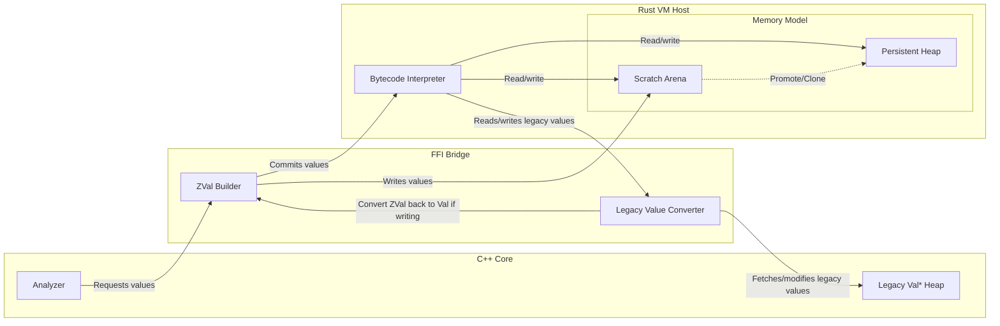

# Problem 1: Memory Model

The scripting implementation is deeply coupled with Zeek. Any analyzer written in C++ *directly creates* pointers to script values. Many plugins and core components take in script values in BiFs (built-in functions), translate them into C++ types, then pass that along to some other system.

This is a manual process: users must create values by hand, then retrieve them by hand, from the scripting engine. You may even change values from the scripting engine within the core.

But, the core does not need to "think" in values like this. It is often better for the core to pass around less, or statically allocate simple objects. Indeed, it does, and many parts only create the Zeek script values when necessary. The goal here, then, is to make the core a *produce* data for the interpreter only when necessary. Then, it will *consume* data that would today be provided through BiFs.

## The Barrier

The core to this problem is how the barrier between the interpreter and core is handled. Since the interpreter owns the values, the core can no longer think in terms of `Val` objects, or intrusive pointers. Instead, there are a set of shared structs which define the memory layout.

First, we have a tagged union. This is basically what `ZVal` is currently. For now, we will ignore the problem of interacting with Zeek values that have not yet swapped, that will come later. Also, this will likely be written in Rust, with `cbindgen` or similar to convert into a header file in C++:

```
struct ZVal {
	uint8_t type_; // The resulting type of the value, without extra info.
	uint8_t flags; // This plus the `type_` can fully describe which union field
				   // to pick. This includes a 'legacy' bit to see if we have to
				   // use as_ptr
	uint16_t extra; // This would be for optimizations, like a length for short
					// strings?

	union {
		int64_t as_int; // zeek_int_t int_val
		uint64_t as_uint; // zeek_uint_t uint_val
		double as_double; // double double_val

		// ZVal then has a list of pointers that it uses. Instead, we will
		// have two options: a pointer into Rust VM memory, or another
		// raw pointer (which would be the legacy Zeek::Val)
		void* as_ptr;
		void* as_legacy;
	} payload;
};
```

This will be a 16-byte struct and can describe *all* Zeek values, legacy or not, within the interpreter and Zeek's core. Complex values remain refcounted, just in Rust world. Ref and unref move from the `Val*` object itself (or `Obj`) into a function that would take any `ZVal` and apply the proper ref/unref semantics.

Creating values is now the concern of the VM. This VM will provide functions which can gather data about the values, like its type, or members within the struct. You would "build up" values to use within the Rust VM from C++, then access them as opaque values.

Any value stored within the VM will have to be built. For this, we would create a C/C++ API which creates the complex values from simple structs. Some of these are easy, like a String can just take in an std::string:

```
ZVal vm_create_string(VM* vm, std::string s);
```

Others, however, will need "built." We do this with a builder:

```
RecordBuilder* vm_begin_record(VM* vm)
```

This creates a builder that we can set fields with:

```
void vm_set_record_field(RecordBuilder* builder, std::size_t idx, ZVal val);
```

> [!NOTE]
> One issue in Zeek right now is the reliance on indices (ie the std::size_t idx) when making record values. I believe we can solve this by creating a "layout" at startup. However, that can be done regardless of backend, so for this, I will continue with this structure. It eases the transition if we simply have to translate one function call to another, rather than create layouts and use them in different ways than Zeek's core currently does.

Then, when we are done, we "finish" the builder, invalidating the pointer, and returning the `ZVal` for what we just created:

```
ZVal vm_end_record(RecordBuilder* builder);
```

Each of these functions are implemented in Rust. It is the interpreter's concern *how* to build the object from various ZVals, it is the core's concern to place them in the right positions.

For the string, the value can be simple: since strings are often immutable, just store the length and the raw string. This can be adapted accordingly. We may also choose to intern strings, or use symbols, or something else, but this is a simple case.

However, cases that produce a builder need to be more complex. The most pressing concern is: what if they never call `vm_end_record`? The builder itself would leak data.

The solution here cannot truly be generalized, it must be the caller's responsibility. Thankfully, we can create a simple solution for Zeek: RAII wrappers. Simply have the builder call `vm_end_record` on destruction, then the `ZVal` will end up with no references and get destroyed.

### Alternative: Arena

We can add another option here: an offset into some "arena" allocation which gets cleared on event drain. The benefit here is that we can clear it extremely quickly. However, we have to separate out a "persistent" space that would hold values which must remain between event handlers.

Since this only helps short-lived aggregate types, the speedups are likely not worth the complexity. Regardless, the proposal is here:



If a value is in arena space and needs to stick around beyond the current event drain, that would be done with a "scratch" arena (eden) and a "persistent" (survivor) heap. In order to make the scratch space last longer than for this packet, it must get promoted. Promotions are handled by the VM when necessary, for example when adding to a vector in persistent memory. Everything in the scratch arena gets deleted after each packet. Allocation is simply bumping the `next` pointer (a bump allocator).

There is a decent crate for this in Rust ([bumpalo](https://github.com/fitzgen/bumpalo)) which we could probably use well. One consideration here is that the internal Rust representation could be:

```
Rc<RefCell<Vec<ZVal>>>
```

That is, a reference counted, internally-mutable, vector of `ZVal`. When using the bump allocator, it doesn't call every `Drop` method, so we would need to keep the "complex" objects (ie anything represented by a pointer) and manually drop them. That means we don't get the full benefit of the arena. Because of this, that would be the representation in the persistent space, but the scratch space would just be a pointer into scratch space. This means that we create our own object representation.

## Another option: Arena Offsets

We could structure the `ZVal` such that pointers back into rust space are purely an offset:

```
struct ZVal {
	union {
		// ...
		uint64_t as_offset;
	} payload;
};
```

This offset is just an index into a scratch arena.

But, this makes us manage our own arenas. It also means that we're rewriting a lot of infrastructure just for refcounting. We can use built-in mechanisms for this, and use the language to better help us.

## Getting values

We also have to get values! The primary case here is when calling a BiF, where we must translate the script-level `Val` into something the C++ core can handle more easily. For this, we would simply have a similar API to the builder.

There will be more on this in the future, since the primary use here is with BiFs. But, there is one concern that is worth addressing early: crossing an FFI boundary *constantly* for value manipulation is expensive.

This proposal would essentially treat values as opaque pointers (unless primitives, of course). Say you have a nested record, you might have to do:

```
auto my_rec = vm_get_rec_field(vm, my_val, 0);
auto my_count_val = vm_get_rec_field(vm, my_val, 5);
auto my_count = my_count_val.payload.as_uint;
```

Readability wise, this is pretty tough. I don't have an exact solution for that, but really it should be solveable with good APIs. For example, we could have record layouts available for lookup by the VM, then the core could point to a nested field and say "give me that." Then the VM goes off and grabs it.

But, if it's not obvious, this would also apply *to all aggregate types*. That means if you want to get all elements within a vector, you would have to cross the FFI boundary *for each one*.

However, I only see this in loggers and cluster publish in the core (which should absolutely be special-cased, discussed later). We could also provide batching operators for vectors. That's certainly reasonable. The point here is that a naive implementation may end up quite slow because each access over an opaque record, vector, or table pointer will be quite slow.

I'm also not sure how much it matters. Zeek itself certainly isn't cleverly designed here. It may be dwarfed by runtime within the core (or within the interpreter) alone. The crux is that if there is a performance issue crossing this FFI boundary, we can provide solutions by asking the VM for a layout of records or batching operations for others.

# Proposal

So, in case it got lost, the main problem here is:

Scripting is deeply coupled with Zeek. We create `Val*` pointers with no intermediate function, gather facts, assign values in them, then shove them off into scriptland. Since the core thinks in `Val*` pointers, it often creates tension when implementing features, analyzers, or core components.

The proposed solution:

1) Move to Rust. This way, any interaction with values must be through a boundary (function calls, etc.) rather than creating `Val` objects directly.
2) Rust handles all values. If a value is stored within Zeek, it is the user's responsibility to ref/unref it. The VM will properly ref/unref by virtue of using `Rc`. In practice, this should entail changing all `Obj::Ref` and `Obj::Unref` with calls to the C wrappers, which in turn will call the relevant ref and unref function.
3) Create simple ways for the core to build up values within the interpreter and retrieve values.

This way, we have a clear barrier between the values that a script handles and the values that the core handles.
