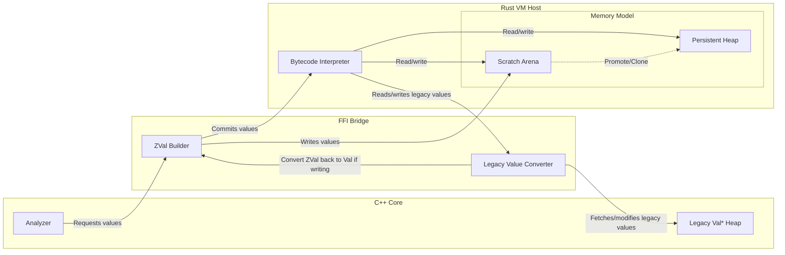

# Problem 1: Tight Coupling

The scripting implementation is deeply coupled with Zeek. Any analyzer written in C++ *directly creates* pointers to script values. Many plugins and core components take in script values in BiFs (built-in functions), translate them into C++ types, then pass that along to some other system.

This is a manual process: users must create values by hand, then retrieve them by hand, from the scripting engine. You may even change values from the scripting engine within the core. 

But, the core does not need to "think" in values like this. It is often better for the core to pass around less, or statically allocate simple objects. Indeed, it does, and many parts only create the Zeek script values when necessary. The goal here, then, is to make the core a *consumer* of the data created by the interpreter. The interpreter owns the data, the core simply updates (or reads) data within it.

## The Barrier

The core to this problem is how the barrier between the interpreter and core is handled. Since the interpreter owns the values, the core can no longer think in terms of `Val` objects, or intrusive pointers. Instead, there are a set of shared structs which define the memory layout. 

First, we have a tagged union. This is basically what `ZVal` is currently. For now, we will ignore the problem of interacting with Zeek values that have not yet swapped, that will come later. Also, this will likely be written in Rust, with `cbindgen` or similar to convert into a header file in C++:

```
struct ZVal {
	uint8_t type_; // The resulting type of the value, without extra info.
	uint8_t flags; // This plus the `type_` can fully describe which union field 
				   // to pick. This includes a 'legacy' bit to see if we have to 
				   // use as_ptr
	uint16_t extra; // This would be for optimizations, like a length for short 
					// strings?
	
	union {
		int64_t as_int; // zeek_int_t int_val
		uint64_t as_uint; // zeek_uint_t uint_val
		double as_double; // double double_val
		
		// ZVal then has a list of pointers that it uses. Instead, we will
		// have two options: an offset (which is the new, fast one) and a
		// raw pointer (which would be the legacy Zeek::Val)
		uint32_t as_offset;
		void* as_ptr;
	} payload;
};
```

This will be a 16-byte struct and can describe *all* Zeek values, legacy or not, within the interpreter and Zeek's core. Complex values will use `as_offset` in order to point to an `Arena`. This arena is where all values get stored, except for legacy `Val`.



Any value stored within the arena will have to be built. For this, we would create a C++ API which creates the complex values from simple structs. Some of these are easy, like a String can just take in an std::string:

```
ZVal vm_create_string(VM* vm, std::string s);
```

Others, however, will need "built." We do this with a builder:

```
RecordBuilder* vm_begin_record(VM* vm)
```

This creates a builder that we can set fields with:

```
void vm_set_record_field(RecordBuilder* builder, std::size_t idx, ZVal val);
```

> [!NOTE]
> One issue in Zeek right now is the reliance on indices (ie the std::size_t idx) when making record values. I believe we can solve this by creating a "layout" at startup. However, that can be done regardless of backend, so for this, I will continue with this structure.

Then, when we are done, we "finish" the builder, invalidating the pointer, and returning the `ZVal` for what we just created:

```
ZVal vm_end_record(RecordBuilder* builder);
```

Each of these functions are implemented in Rust. It is the interpreter's concern *how* to build the object from various ZVals, it is the core's concern to place them in the right positions.

For the string, the value can be simple: since strings are often immutable, just store the length and the raw string. This can be adapted accordingly. We may also choose to intern strings, or use symbols, or something else, but this is a simple case.

However, cases that produce a builder need to be more complex. The most pressing concern is: what if they never call `vm_end_record`? Then we keep the value around forever in the arena, so it's a memory leak. Not good. One part of this solution is simple: create C++ wrappers which call `begin_record` on creation and `end_record` on destruction. But we should still handle this case, in case something falls through.

The solution here can vary. One proposal is to just keep it around, bump the `next` of the linear memory, etc. But, at the end of the packet, run a compacting garbage collector to gather any unreferenced values. We would store the refcount somewhere in the value.

This could be made more efficient with "tenuring" ie if an object sticks around, move it to another space that is less likely to need collection.

But, we could also have a "scratch" arena (eden) and a "persistent" (survivor) heap. In order to make the scratch space last longer than for this packet, it must get promoted. Promotions are handled by the VM when necessary, for example when adding to a vector in persistent memory. Everything in the scratch arena gets deleted after each packet. Allocation is simply bumping the `next` pointer (a bump allocator).

The bump allocator needs a special consideration: If a Zeek value is in the scratch space, and that counts as a reference, simply wiping the scratch space would leak memory. Instead, it should keep references to any legacy `Val*` used. This would be done with a finalizer list. Before wiping the `next` pointer, we would run through each element of that list and unref it, so that the C++ code can wipe it if it is unreferenced. We need to scan each aggregate type again, since it can be written in the background. The finalizer list, therefore, would hold pointers to all complex types in the scratch space.

Any persistent objects, then, are similar to managed values: they get refcounted just as before.

## Getting values

We also have to get values! The primary case here is when calling a BiF, where we must translate the script-level `Val` into something the C++ core can handle more easily. For this, we would simply have a similar API to the builder.

There will be more on this in the future, since the primary use here is with BiFs.

## Generations

When using the scratch space, we have to consider that some part of the system may access something which is invalid. Imagine it keeps around a pointer to offset 100 in a `ZVal` in scratch space. The packet ends, so that points to nothing. Then, a new packet arrives, and we pass that `ZVal` in. There is not a good mechanism to determine that `ZVal` is old, so it would likely crash or corrupt something.

We should not fix this as it is a bug, but we can prevent this bug from affecting the system. There are two possibilities: We have extra space in `ZVal`, so we could store a 32-bit offset and 32-bit generation. Or, we can use the `extra` space to store a generation number. Each access of a `ZVal` would check to ensure the generation number is the same as the current generation. This is purely to avoid bugs, but an important distinction.

## Resizing

Part of the worry with the arena space is resizing. In the current proposal, if you push an element to a vector, it must check if it's at the end of the scratch space. If not, there might be a `ZVal` directly after the vector, so we must copy the vector to the end!

There are a few options:

1) Do nothing. This copying mechanism is fine. We might hit trouble with the "pass by reference" nature of a vector.
2) Vectors can add a "link" that tells you where to keep looking, or an end delimeter if it's done. But, then we lose advantages of contiguous memory.
3) Oversizing, so vectors have a capacity and get resized.

Because it's similar to C++ `std::vector`, I would vote for 3. But, the other 2 options are worth considering, especially if we consider that adding to a vector multiple times would still be fast if it's still at the end of the arena.

Note that 1 can be combined with oversizing, since we don't need to clone if it's at the end. We just tell it to grab more memory.

## Moving to persistent memory

When an object is assigned from the scratch arena (like a local variable or a temporary) to the persistent space (like a table or `connection` record), it will get *deep copied*. This is slow and potentially error prone (what if it's self-referential or has many `Val*`? How do reference values get counted?).

Thus, we should likely make some APIs available to write to persistent space from the C++ engine, rather than scratch, but use them sparingly (like the `connection` record).

There is also a whole class of optimizations that could help here. If we see adding an element to a persistent vector, we can simply construct it in-place in persistent memory. These would likely be specialized opcodes.

# Proposal

So, in case it got lost, the main problem here is:

Scripting is deeply coupled with Zeek. We create `Val*` pointers with no intermediate function, gather facts, assign values in them, then shove them off into scriptland. Since the core thinks in `Val*` pointers, it often creates tension when implementing features, analyzers, or core components.

The proposed solution:

1) Move to Rust. This way, any interaction with values must be through a boundary (function calls, etc.) rather than creating `Val` objects directly.
2) Switch the memory model to distinguish between "scratch" and "persistent" space, where the core can consider whether the values must be temporary or persistent.
3) Create simple ways for the core to build up values within the interpreter and retrieve values.

This way, we have a clear barrier between the values that a script handles and the values that the core handles. 
