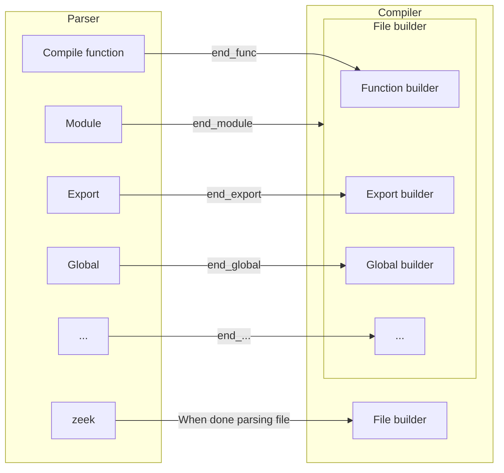

# Proposed Architecture

Armed with the proposed solutions in the previous section, this section will focus on an end-to-end architecture. Details may be omitted if deemed unnecessary or up to implementation. Code will generally be minimal examples at best.

The proposal has not touched much on certain aspects, like the particular instruction set, or where in the pipeline the code will get compiled. That is partially because those will be easiest (for now) by using ZAM. The instruction set will be very similar to ZAM. The entrypoint will also be similar to ZAM. Therefore, they weren't problems, they will simply be part of the flow used in diagrams here. The goal is to only rewrite if it provides a considerable benefit.

## The Flow

The simplest approach is to consider compiling the bytecode separately from using the bytecode. Here, we will assume that all Zeekscripts are compiled into bytecode first, then loaded on invocation.

First, how are the scripts compiled? This is a little more complicated than it should be, since the Zeek compiler just builds declarations up. To get around this, the current script optimizations just hook into `end_func`, which gets called by the parser. This works, but we need this for anything that Zeek can run, including `@load` and whatnot. The bytecode needs to be standalone, so we need *everything*.

In order to achieve this, we will admittedly be a bit heavy-handed. Similar to the script optimization, `end_func` will be used to compile functions. But each top-level structure needs a similar hook, where we can build up state.

Each file would dump compiled bytecode objects into a directory, one for each file.

Essentially, we just compile each "thing" when we see it, then "commit" the file when we finish parsing the file.

> [!NOTE]
> This should require minimal changes to the existing AST. While some approaches may put logic in the AST, this one is meant to be a completely separate entity in order to decouple compilation from the AST itself. The AST should never, ever need special methods or otherwise know that it will be in an optimized state.

### Aside: Rewriting the Parser

This would be much easier if we had a Zeekscript parser that just gave us an AST, no frills attached. We don't even get a real compilation unit or AST from this structure. So we have some other options, but it may not be worth it at first.

First, we could rewrite the parser from scratch. Bison parsers aren't really used much nowadays, much less for a "production grade" parser. So we could write a new parser. The two primary alternatives would be ANTLR and recursive descent. An ANTLR parser probably doesn't buy us much over the current one, other than removing accumulated tech debt. A recursive descent parser would be the general purpose approach, and would improve error messages considerably. Both come with a significant development time, considering the Zeek grammar is not the cleanest, with no clear and obvious benefit.

Second, we could use the tree sitter parser that already exists. The downside here is that tree sitter parsers are meant more for development tooling. It's good at recovering from errors and incremental parsing, but bad at forcing the particular structure we need and building up real objects from the output. Furthermore, we would need to harden the parser significantly so that it doesn't allow bad code.

To get started, it's likely easiest to stick with the current approach, then hack in some hooks to get what we need. In the future, we should visit rewriting the parser, or just making a new version of the language (more on that later).

## Execution

Now, assume that we have a compiler which compiles Zeek scripts down into Zeek bytecode (`.zbc`) files (which is a big ask!). 
