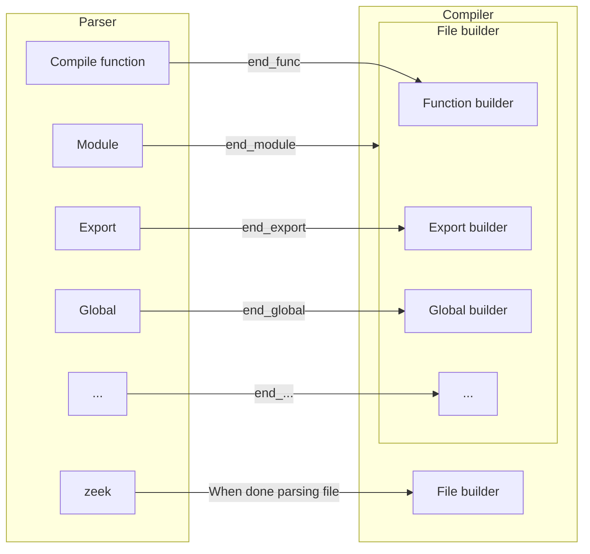
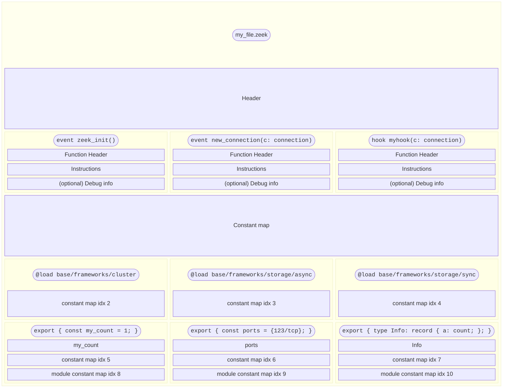
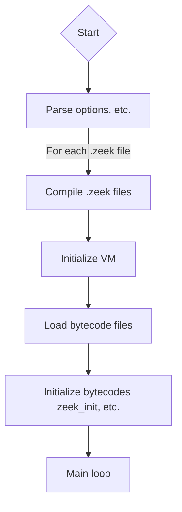

# Proposed Architecture

Armed with the proposed solutions in the previous section, this section will focus on an end-to-end architecture. Details may be omitted if deemed unnecessary or up to implementation. Code will generally be minimal examples at best.

The proposal has not touched much on certain aspects, like the particular instruction set, or where in the pipeline the code will get compiled. That is partially because those will be easiest (for now) by using ZAM. The instruction set will be very similar to ZAM. The entrypoint will also be similar to ZAM. Therefore, they weren't problems, they will simply be part of the flow used in diagrams here. The goal is to only rewrite if it provides a considerable benefit.

## The Flow

The simplest approach is to consider compiling the bytecode separately from using the bytecode. Here, we will assume that all Zeekscripts are compiled into bytecode first, then loaded on invocation.

First, how are the scripts compiled? This is a little more complicated than it should be, since the Zeek compiler just builds declarations up. To get around this, the current script optimizations just hook into `end_func`, which gets called by the parser. This works, but we need this for anything that Zeek can run, including `@load` and whatnot. The bytecode needs to be standalone, so we need *everything*.

In order to achieve this, we will admittedly be a bit heavy-handed. Similar to the script optimization, `end_func` will be used to compile functions. But each top-level structure needs a similar hook, where we can build up state.

Each file would dump compiled bytecode objects into a directory, one for each file.

Essentially, we just compile each "thing" when we see it, then "commit" the file when we finish parsing the file.

> [!NOTE]
> This should require minimal changes to the existing AST. While some approaches may put logic in the AST, this one is meant to be a completely separate entity in order to decouple compilation from the AST itself. The AST should never, ever need special methods or otherwise know that it will be in an optimized state.

### Aside: Rewriting the Parser

This would be much easier if we had a Zeekscript parser that just gave us an AST, no frills attached. We don't even get a real compilation unit or AST from this structure. So we have some other options, but it may not be worth it at first.

First, we could rewrite the parser from scratch. Bison parsers aren't really used much nowadays, much less for a "production grade" parser. So we could write a new parser. The two primary alternatives would be ANTLR and recursive descent. An ANTLR parser probably doesn't buy us much over the current one, other than removing accumulated tech debt. A recursive descent parser would be the general purpose approach, and would improve error messages considerably. Both come with a significant development time, considering the Zeek grammar is not the cleanest, with no clear and obvious benefit.

Second, we could use the tree sitter parser that already exists. The downside here is that tree sitter parsers are meant more for development tooling. It's good at recovering from errors and incremental parsing, but bad at forcing the particular structure we need and building up real objects from the output. Furthermore, we would need to harden the parser significantly so that it doesn't allow bad code.

To get started, it's likely easiest to stick with the current approach, then hack in some hooks to get what we need. In the future, we should visit rewriting the parser, or just making a new version of the language (more on that later).

## Bytecode Structure

The bytecode is primarily a serialized version of ZAM. In order to serialize ZAM, some changes are necessary.

1) Constants must be serialized in a constant pool, not referred to by a pointer.
2) Exports must be serialized with their name in the bytecode.
3) Any `@load` must be serialized, with lookups done at runtime.

With that, here is the proposed complete structure:

> [!NOTE]
> The circles contain the code, they are not in the actual bytecode. They are for reference. Also, the constant indexes will be array indices, but here they are dummy values.

The headers include information like:

1) Offsets for each section
2) Filename

Function headers are similar. They may need:

1) Function name
2) Number of frame slots

## Execution

Now, assume that we have a compiler which compiles Zeek scripts down into Zeek bytecode (`.zbc`) files (which is a big ask!). How do we execute a bytecode file? How does it execute alongside other script files?

We will consider two cases: when *all* code is (or can be compiled to) bytecode, and when a subset of code must remain with the old interpreter.

### All Bytecode

This is the end goal. When shipping Zeek, it is shipped with `.zbc` files for its core functionality. Users put `.zbc` files anywhere that script files are expected. These load and act exactly the same as Zeek scripts, but they must be compiled with any changes.

Note that we can still easily allow `.zeek` files: just do what ZAM currently does. We can compile the Zeekscripts down into `.zbc` files, then execute them, just as easily as in separate steps. We may keep these in memory or keep the `.zbc` files in a temporary directory, it really doesn't matter. Regardless, once we can reliably compile Zeekscripts to `.zbc` files, the only thing we have to worry about is bytecode execution.

So: what does the flow through Zeek look like when everything is a bytecode? Here's a flow chart!

The only real change is that we must compile scripts before any `zeek_init` (but after plugin loads) and initialize the VM. The changes are pretty minimal, it's mostly *where* it happens. For example, the initial event drain for initialization happens within the VM, not within the core. But, other than that, the actual differences should be relatively subtle.

The main loop will look almost exactly the same as it does now. The only difference is, again, *where* the work happens. When draining the event queue, work does not happen in the interpreter, it happens in the Rust VM. When enqueueing events, that goes through the Rust VM. The flow will be almost exactly the same.

## Transition Period

However, there is a sad reality here: there will be a transition period where we cannot compile *all* scripts to bytecode. For this period, we can accept innefficiencies: more copies, more conversions between new values and old values. The goal is to have it work, but we will not run this in production anywhere.

For this, the Rust VM will start execution no matter if the function is only executable with the old interpreter. Since `ZVal` can hold "legacy" value pointers, we can still refer to `ZVal` within the Rust VM. However, the Rust VM will not know how to modify a legacy value, so it will always convert those to native `ZVal` whenever they are used. This is the "tax" you pay for calling legacy functions.

Thus, the call from the new VM to the legacy interpreter will look like:

1) Find the corresponding function pointer
2) Determine that it is legacy
3) Calculate any arguments, then convert them to legacy values
4) Use a dedicated shim to call legacy functions and get its result as a legacy value
5) Update any `ZVal` that would be updated by converting legacy values back into `ZVal`
6) Return the `ZVal` (which is a wrapper around the legacy value)

Step 5 is the interesting one here: if we pass an aggregate type, the legacy script may change the value! If it does that, then we later have to reflect those changes in the `ZVal`, even if it wasn't a legacy value when it was called.

This means that we may convert huge structures back and forth from `ZVal`, which will be horrible for performance. However, the goal here is *correctness*, not speed. Speed will come when the *new backend* is actually the entire execution engine of Zeekscript, not some alternative that gets called sometimes.

We may also have the alternative: a legacy script function calls a function that was *only* provided in a bytecode file. One option is to basically disallow this, but that hurts flexibility. But the proposal here would be quite similar:

1) Find the corresponding function pointer
2) Determine that it is bytecode
3) Calculate any arguments, then wrap them in `ZVal` as legacy pointers
4) Use a dedicated shim to call the bytecode function from Zeek's core
5) Update any legacy pointers that would be updated by converting `ZVal` back into legacy values
6) Convert the return value into legacy value and return that

One important point here is that this scenario will only happen when we've already called a legacy function from the bytecode. Thus, we are likely doing *two* conversions of values into legacy values, then back to `ZVal`. Again, this will be a performance killer in the short term.

> [!NOTE]
> The alternative to this is not much better: the Rust VM gets full understanding of working with Zeek script values, then can easily fall back on that. Handling the FFI boundary with pointers like this would not be particularly easy, but potentially doable. A primary concern, however, is this keeps us stuck to the old value semantics. Since the transition is explicitly part of the development phase, and won't be used in production code, we can architect it to treat those cases as edge cases. We do not need to engrain current value semantics into the new value design, they simply convert when needed using helpers.

Thus, we have a new model for how any Zeek scripts are called and handled.
